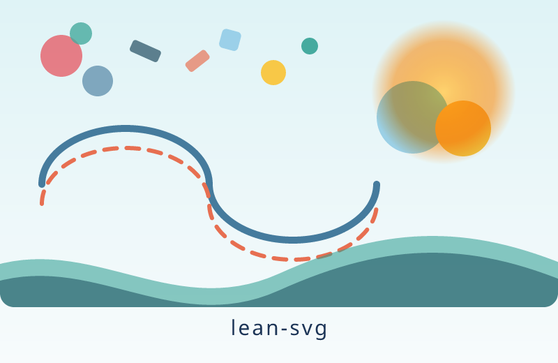
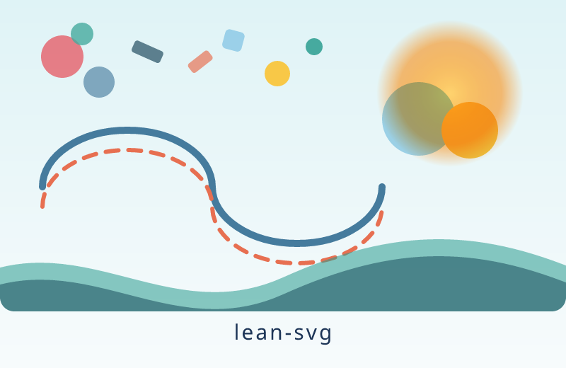
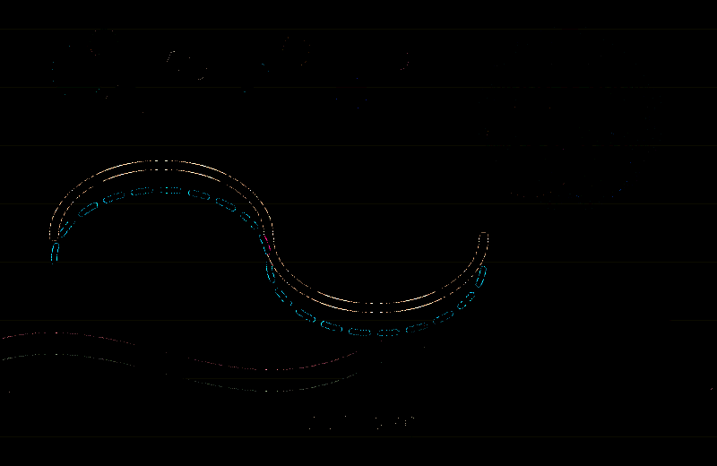
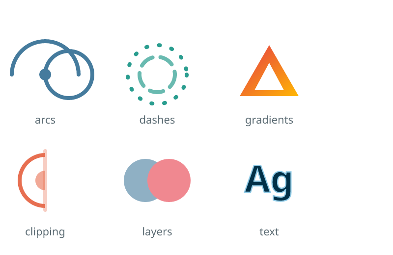
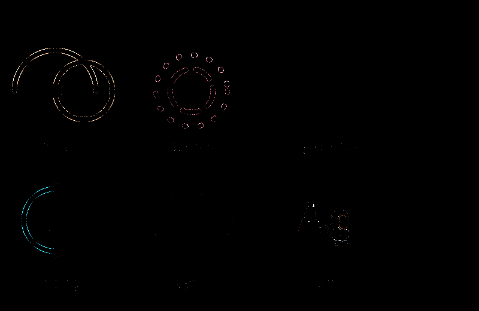
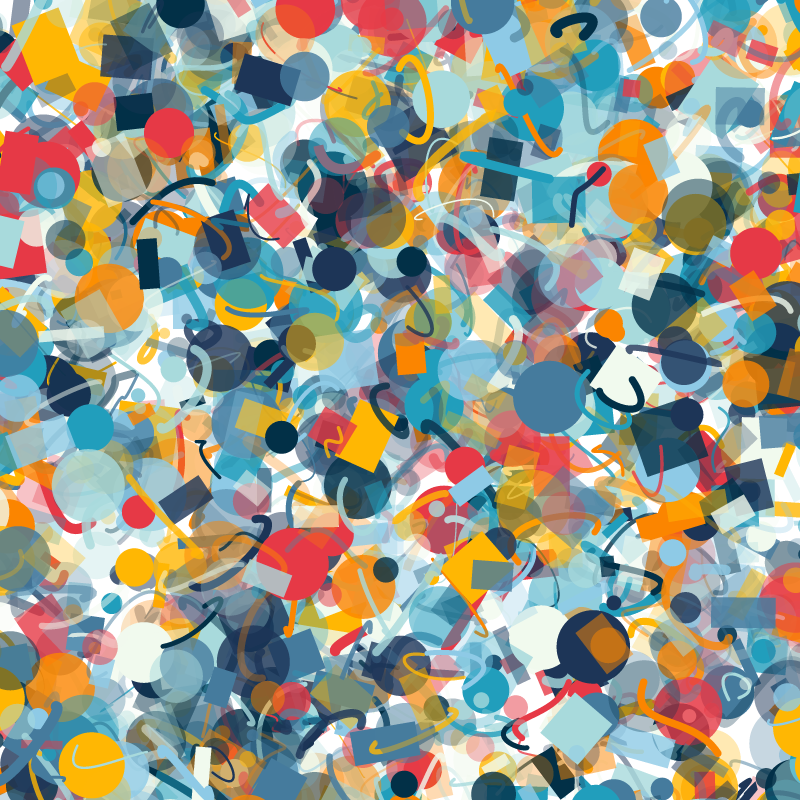
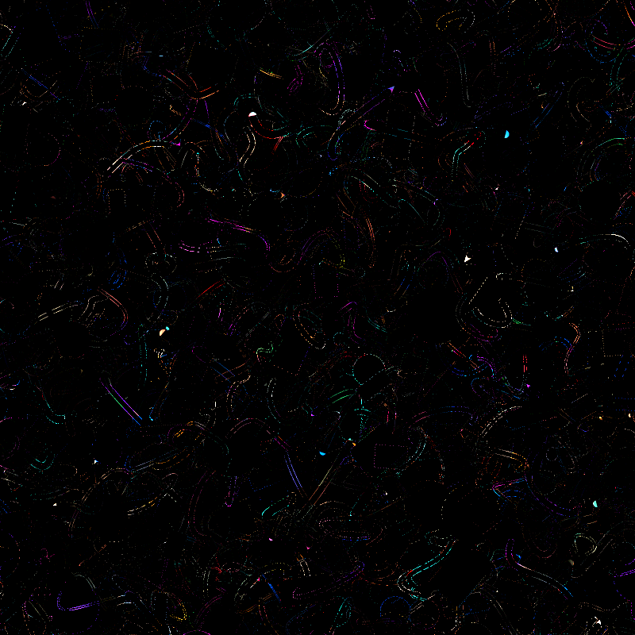

# lean-svg
## Human Preamble
An experiment in specification based programming.
The overall goal here is to my understanding of theorems on programs, and how to use theorems on programs to allow for more unrestricted use of computer generated code.
A few goals of this program are as follows:

- One input one ouptut, only the specified files should be touched and there should be no side effects asides from reading the input file and writing to the output file. This should be fairly easy to prove also by way of the Input output Monad. But does require us to trust the commands that it is calling. This also makes the program safer to run because I know it won't be able to touch other files despite how it is optimized.
- No hang states, this program should have some limits to how long it can run and how much memory it uses, to prevent it from overflowing.
- maximum output size, this program should have a maximum output size defined by the canvas size.

Long term
- Defined file output type: this program should only be able to create a valid PNG output, this will require a specification for the PNG filetype which may take considerably more time since this entire spec may need to be hand written.
- more features for SVGs
- Better font support, curently fonts ship with the program and can't use system fonts, I want to find a safer way of reading the font cache but haven't decided on what that means yet.
- Better multi core and gpu support
- aenas translation to rust. Getting provable guarantees is also possible by translating rust into lean and proving things about the translation. The eventual goal of this project is to see how close to speed parity we can get with resvg. This won't work for all rust but it might be enough to get major speedups and get things close enough to be happy.
- have all tests and harnesses for performance be written in lean
- Rewrite entire spec and go over it in closer detail


## How close is it?

Two original test images and the project's stress field, rendered by lean-svg
and by [resvg](https://github.com/linebender/resvg) 0.48.1. The third column
amplifies every difference 12x.

| | lean-svg | resvg 0.48.1 | difference (12x) |
|---|---|---|---|
| **confetti**<br>gradients, group opacity, blend modes, arcs, dashes, clipping, text | <br>99% within 8<br>98% exact<br>63 ms | <br>n/a<br>n/a<br>14 ms | <br>n/a<br>n/a<br>n/a |
| **icons**<br>arcs, dashes, gradients, clipPath, layers, text | <br>99% within 8<br>99% exact<br>26 ms | <br>n/a<br>n/a<br>10 ms | <br>n/a<br>n/a<br>n/a |
| **stress**<br>~1500 overlapping translucent shapes | <br>98% within 8<br>93% exact<br>242 ms | <br>n/a<br>n/a<br>87 ms | <br>n/a<br>n/a<br>n/a |

Rendered at 800 px wide on an 8-core arm64 MacBook, macOS 26.6.2. Times are the
median of five runs of the whole binary, including process start, parsing and
PNG encoding. Reproduce with `python3 docs/readme/render.py`.

All three SVGs are this project's own artwork, Apache-2.0.

## Generated Readme

Fidelity is checked against [resvg](https://github.com/linebender/resvg); 

## Build and run

```bash
lake build
.lake/build/bin/lean-svg tests/svg/01_triangle.svg out.png
.lake/build/bin/lean-svg in.svg out.png --width 800 --background white
# one 512x512 tile of a 4000 px wide image, for a zoomable viewer
.lake/build/bin/lean-svg in.svg tile.png --width 4000 --viewport 1744 1744 512 512
```

Exit codes: 0 success, 1 render error (message on stderr, no file written),
2 bad arguments.

## Test

```bash
brew install resvg        # oracle
make test                 # fidelity vs resvg → tests/out/report.html
make adversarial          # hostile inputs: no crash, no hang, no stray files
make tiles                # --viewport tiles stitch back to the full render
python3 playground/server.py   # http://127.0.0.1:8765 — draw and compare
```

## Read next

- `SPEC.md` — every claim in English beside its Lean form, and an explicit list
  of what is *not* proven.
- `learn/` — a standalone hello-world project that builds the effect monad from scratch, with an exercise (kept locally, not tracked in this repository).
  scratch, with an exercise: prove no-clobber yourself.
- `proofs/` — proof work in progress, kept outside the `LeanSvg` library so
  that unfinished proofs cannot reach `lake build`. `SizeBound.lean` is an
  attempt at an output-size bound: the supporting lemmas check, the two
  theorems that would establish the bound are still holes. Nothing here is a
  claim yet.
- `ROADMAP.md` — features remaining, and difficulty estimates for the
  theorems not yet attempted.
- `DESIGN.md` — what is proven, what is trusted, threat model, algorithms.
- `PLAN.md` — milestones, settled decisions, what to delegate.

## Licensing and credits

lean-svg is licensed under the Apache License 2.0 (`LICENSE`). `NOTICE`
carries these credits and accompanies any redistribution.

Each licence below was verified against the upstream project's own licence
files and package manifests on 2026-09-21.

### Redistributed by this repository

| component | licence |
|---|---|
| **Noto Sans** Regular, Bold and Italic — Latin subsets generated into `LeanSvg/Fonts/*.lean` and compiled into the binary | SIL Open Font License 1.1. Copyright 2015 Google Inc. All Rights Reserved. Noto is a trademark of Google Inc.; trademarks are not licensed under the OFL. Version 2.000 (GOOG). Full text and copyright notice in `LeanSvg/Fonts/LICENSE-OFL.txt`. The faces are subsetted, which the OFL permits; Noto declares no Reserved Font Name. |
| **Original artwork and renders** — `tests/svg/*.svg`, `docs/readme/*.svg`, and the PNG images in this README | Apache-2.0. Authored for this project. |

### Not redistributed

The test corpora are cloned locally by the test harnesses, are excluded by
`.gitignore`, and are neither committed to this repository nor included in any
release artifact.

| component | licence |
|---|---|
| **resvg test suite** (`tests/corpora/resvg-test-suite`) | MIT. Copyright (c) 2018 Reizner Evgeniy |
| **simple-icons** | CC0-1.0 |
| **Feather icons** | MIT. Copyright (c) 2013-2023 Cole Bemis |
| **resvg** binary, used as the rendering oracle | Apache-2.0 OR MIT |
| **Pillow**, **NumPy**, **fontTools**, used by the test scripts | MIT-CMU, BSD-3-Clause, MIT |

### Algorithms re-implemented

| component | licence |
|---|---|
| **tiny-skia** — [linebender/tiny-skia](https://github.com/linebender/tiny-skia) | BSD-3-Clause. Copyright (c) 2011 Google Inc.; Copyright (c) 2020 Yevhenii Reizner. tiny-skia is a port of Skia, and its licence carries both notices. |

The anti-aliased scan converter, hairline stroking, cubic and quadratic
subdivision counts, dash-splitting rules, `lowp` blend arithmetic, `f32`
layer-compositing pipeline and gradient evaluation in
`LeanSvg/{Raster,Geom,Canvas,Shader}.lean` are fixed-point Lean
re-implementations of tiny-skia's algorithms. No Rust or C++ source is included
in this repository. The BSD-3-Clause notice is reproduced here and in `NOTICE`.

### Behavioural references

| component | licence |
|---|---|
| **resvg** and **usvg** — [linebender/resvg](https://github.com/linebender/resvg) | Apache-2.0 OR MIT, as declared in the workspace manifest at tag `v0.48.1` and on `main`. Releases prior to the relicensing were MPL-2.0. |
| **simplecss** — [linebender/simplecss](https://github.com/linebender/simplecss) | Apache-2.0 OR MIT |
| **svgtypes** — [linebender/svgtypes](https://github.com/linebender/svgtypes) | Apache-2.0 OR MIT |

resvg and usvg define the reference behaviour for this renderer: parsing
defaults, conditional processing, the CSS cascade, paint servers, clipping and
text layout. The CSS selector subset in `LeanSvg/Css.lean` follows simplecss's
grammar; colour, length and transform parsing follow svgtypes. No source from
these projects is included in this repository.

### Language and toolchain

| component | licence |
|---|---|
| **Lean 4** and **Lake** — [leanprover/lean4](https://github.com/leanprover/lean4) | Apache-2.0 |

The project has no other build dependencies.

### Prior art

**lean-zip** — [kim-em/lean-zip](https://github.com/kim-em/lean-zip),
Apache-2.0. The single-input, single-output effect-boundary structure of this
project follows its design. No code is shared.

If you believe something here is miscredited or missing, please open an issue.
