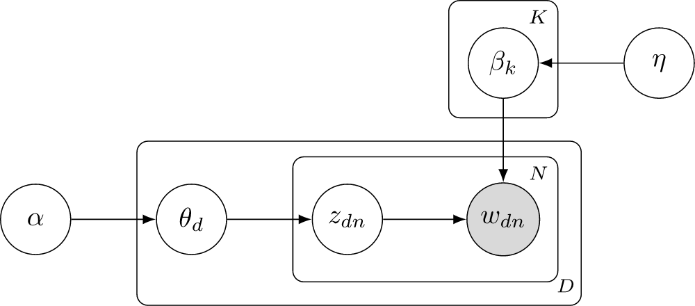
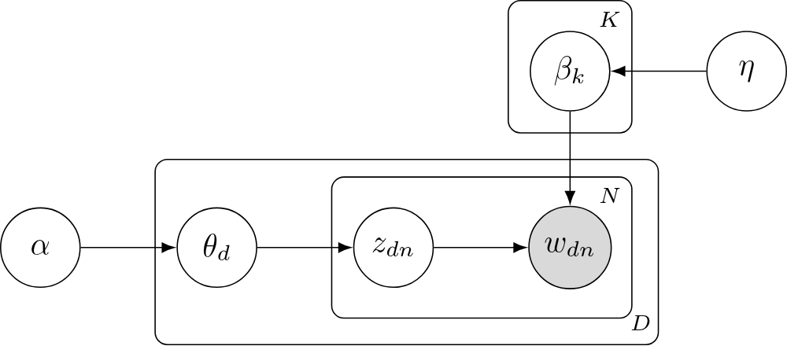
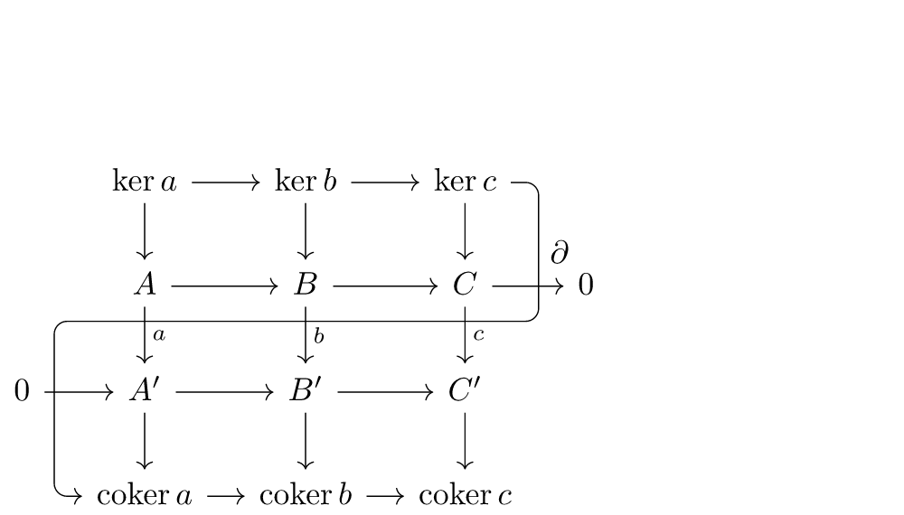
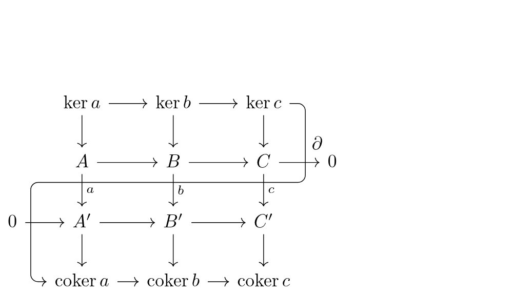
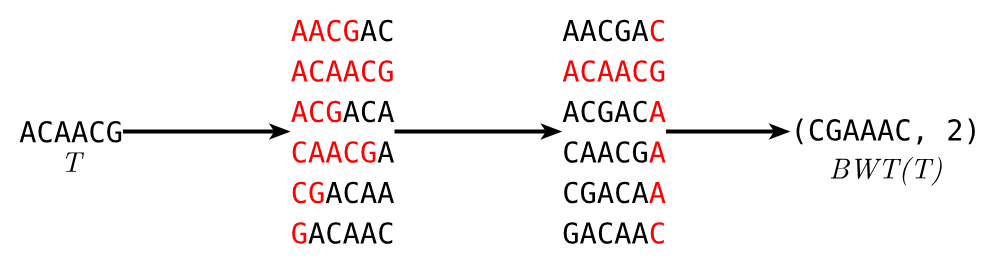
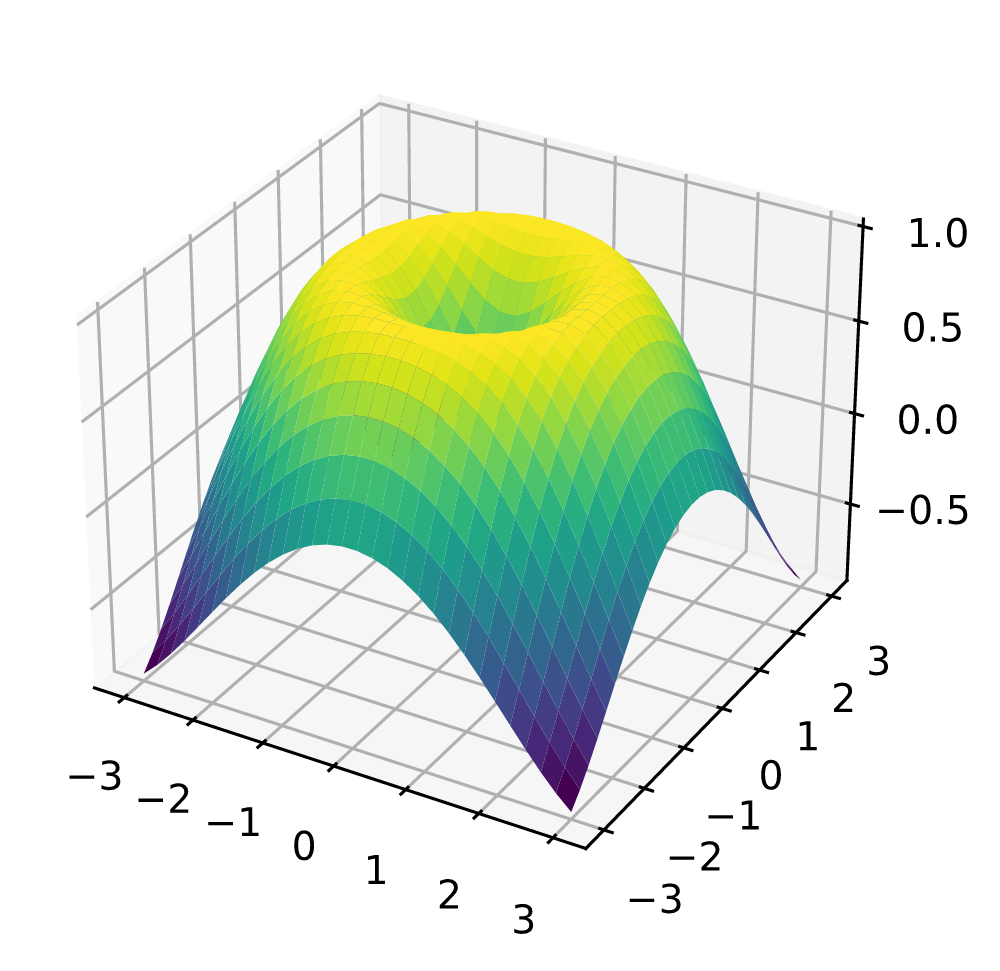
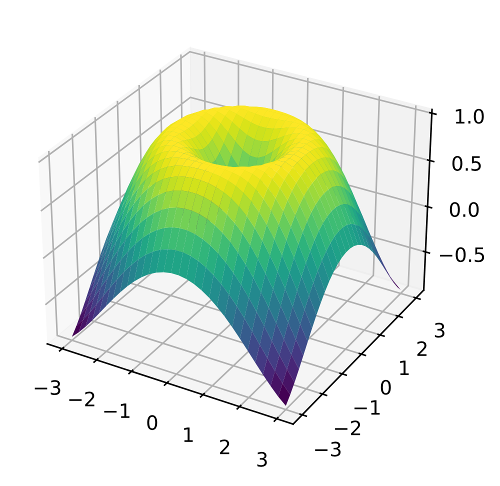

# lean-svg

Licence: [Apache-2.0](LICENSE). Third-party fonts, data and test files: [LICENSING.md](LICENSING.md).

## Human Preamble
An experiment in specification based programming.
The overall goal here is to my understanding of theorems on programs, and how to use theorems on programs to allow for more unrestricted use of computer generated code.
A few goals of this program are as follows:

- One input one ouptut, only the specified files should be touched and there should be no side effects asides from reading the input file and writing to the output file. This should be fairly easy to prove also by way of the Input output Monad. But does require us to trust the commands that it is calling. This also makes the program safer to run because I know it won't be able to touch other files despite how it is optimized.
- No hang states, this program should have some limits to how long it can run and how much memory it uses, to prevent it from overflowing.
- maximum output size, this program should have a maximum output size defined by the canvas size.

Long term
- Defined file output type: this program should only be able to create a valid PNG output, this will require a specification for the PNG filetype which may take considerably more time since this entire spec may need to be hand written.
- more features for SVGs
- Better font support, curently fonts ship with the program and can't use system fonts, I want to find a safer way of reading the font cache but haven't decided on what that means yet.
- Better multi core and gpu support
- aenas translation to rust. Getting provable guarantees is also possible by translating rust into lean and proving things about the translation. The eventual goal of this project is to see how close to speed parity we can get with resvg. This won't work for all rust but it might be enough to get major speedups and get things close enough to be happy.
- have all tests and harnesses for performance be written in lean
- Rewrite entire spec and go over it in closer detail


## Examples

Test images drawn for this project (Apache-2.0), lean-svg vs resvg 0.48.1 at 800 px.

| | lean-svg | resvg 0.48.1 | difference (12x) |
|---|---|---|---|
| **confetti**<br>gradients, group opacity, blend modes, arcs, dashes, clipping, text | <br>99% within 8<br>98% exact<br>63 ms | <br>n/a<br>n/a<br>14 ms | <br>n/a<br>n/a<br>n/a |
| **icons**<br>arcs, dashes, gradients, clipPath, layers, text | <br>99% within 8<br>99% exact<br>26 ms | <br>n/a<br>n/a<br>10 ms | <br>n/a<br>n/a<br>n/a |
| **stress**<br>~1500 overlapping translucent shapes | <br>98% within 8<br>93% exact<br>242 ms | <br>n/a<br>n/a<br>87 ms | <br>n/a<br>n/a<br>n/a |

Charts from the real-world test corpus at 1000 px on white, lean-svg vs Chromium 141.

<table>
<tr><th colspan="2" align="left">LDA plate diagram (TikZ)<br><sub>SVG Apache-2.0; glyphs AMSFonts, SIL OFL 1.1 (<a href="licenses/corpora/amsfonts-OFL.txt">licence</a>) · <a href="tests/corpora/realworld/src/tikz/bayesnet_plate.tex">source</a></sub></th></tr>
<tr><td>lean-svg</td><td></td></tr>
<tr><td>Chromium</td><td></td></tr>
<tr><th colspan="2" align="left">Snake lemma (TikZ)<br><sub>SVG Apache-2.0; glyphs AMSFonts, SIL OFL 1.1 (<a href="licenses/corpora/amsfonts-OFL.txt">licence</a>) · <a href="tests/corpora/realworld/src/tikz/cd_snake_lemma.tex">source</a></sub></th></tr>
<tr><td>lean-svg</td><td></td></tr>
<tr><td>Chromium</td><td></td></tr>
<tr><th colspan="2" align="left">Burrows–Wheeler transform (TikZ)<br><sub>MIT (<a href="licenses/corpora/janosh-diagrams-license.txt">licence</a>) · <a href="https://github.com/janosh/diagrams/tree/main/assets/burrows-wheeler-transform">janosh/diagrams</a></sub></th></tr>
<tr><td>lean-svg</td><td></td></tr>
<tr><td>Chromium</td><td></td></tr>
<tr><th colspan="2" align="left">3D surface (matplotlib)<br><sub>SVG Apache-2.0; text in DejaVu Sans (<a href="licenses/fonts/DejaVu-LICENSE.txt">licence</a>) · <a href="tests/corpora/realworld/src/gen_matplotlib.py">source</a></sub></th></tr>
<tr><td>lean-svg</td><td></td></tr>
<tr><td>Chromium</td><td></td></tr>
</table>

## Build and run

```bash
lake build
.lake/build/bin/lean-svg tests/svg/01_triangle.svg out.png
.lake/build/bin/lean-svg in.svg out.png --width 800 --background white
# one 512x512 tile of a 4000 px wide image, for a zoomable viewer
.lake/build/bin/lean-svg in.svg tile.png --width 4000 --viewport 1744 1744 512 512
```

lean-svg prints nothing, ever: no stdout, no stderr. Its only outputs are
the output file(s) and the exit code:

| code | meaning |
|---|---|
| 0 | success, no warnings; the PNG is written |
| 2 | success with warnings (e.g. a `font-family` drawn in Noto Sans instead); the PNG is written. By default the warnings are dropped and this code is the only signal. With `--warnings` they are also written to `<output>.warnings.txt` |
| 1 | failure, nothing written: bad arguments, unreadable input, the output path (or, with `--warnings`, `<output>.warnings.txt`) already exists, or a render error |

Flags: `--width N`, `--zoom Z`, `--background COLOR`, `--viewport X Y W H`
(render only the W×H window at (X, Y) of the zoomed image; X, Y may be
negative; zoom above 4096× is clamped), `--threads N` (horizontal bands,
byte-identical output; 0 or 1 = serial), `--warnings` (opt in to the
warnings file).

## Test

```bash
brew install resvg        # oracle
make test                 # fidelity vs resvg → tests/out/report.html
make adversarial          # hostile inputs: no crash, no hang, no stray files
make tiles                # --viewport tiles stitch back to the full render
make full-check           # every test, whole corpus, byte lock (before finalizing)
```

What is proved: [spec/README.md](spec/README.md) (check with `scripts/check-theorems.sh`).

## Licensing and credits

lean-svg is Apache-2.0. Third-party fonts, data, algorithms and test files, with
their verbatim licence texts: [LICENSING.md](LICENSING.md).
