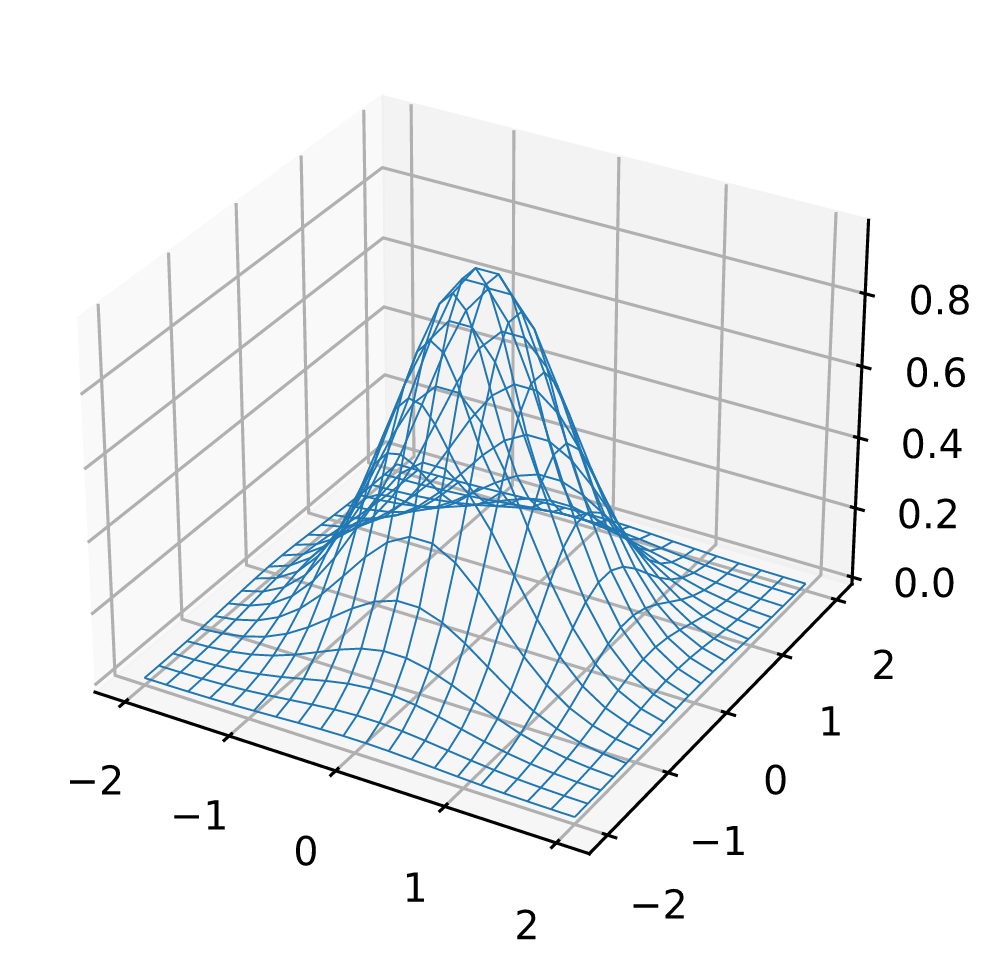

# lean-svg

Licence: [Apache-2.0](LICENSE). Third-party fonts, data and test files: [NOTICE](NOTICE), [licenses/](licenses/) and the [licensing review](docs/LICENSING-REVIEW.md).

## Human Preamble
An experiment in specification based programming.
The overall goal here is to my understanding of theorems on programs, and how to use theorems on programs to allow for more unrestricted use of computer generated code.
A few goals of this program are as follows:

- One input one ouptut, only the specified files should be touched and there should be no side effects asides from reading the input file and writing to the output file. This should be fairly easy to prove also by way of the Input output Monad. But does require us to trust the commands that it is calling. This also makes the program safer to run because I know it won't be able to touch other files despite how it is optimized.
- No hang states, this program should have some limits to how long it can run and how much memory it uses, to prevent it from overflowing.
- maximum output size, this program should have a maximum output size defined by the canvas size.

Long term
- Defined file output type: this program should only be able to create a valid PNG output, this will require a specification for the PNG filetype which may take considerably more time since this entire spec may need to be hand written.
- more features for SVGs
- Better font support, curently fonts ship with the program and can't use system fonts, I want to find a safer way of reading the font cache but haven't decided on what that means yet.
- Better multi core and gpu support
- aenas translation to rust. Getting provable guarantees is also possible by translating rust into lean and proving things about the translation. The eventual goal of this project is to see how close to speed parity we can get with resvg. This won't work for all rust but it might be enough to get major speedups and get things close enough to be happy.
- have all tests and harnesses for performance be written in lean
- Rewrite entire spec and go over it in closer detail


## How close is it?

Two original test images and the project's stress field, rendered by lean-svg
and by [resvg](https://github.com/linebender/resvg) 0.48.1. The third column
amplifies every difference 12x.

| | lean-svg | resvg 0.48.1 | difference (12x) |
|---|---|---|---|
| **confetti**<br>gradients, group opacity, blend modes, arcs, dashes, clipping, text | <br>99% within 8<br>98% exact<br>63 ms | <br>n/a<br>n/a<br>14 ms | <br>n/a<br>n/a<br>n/a |
| **icons**<br>arcs, dashes, gradients, clipPath, layers, text | <br>99% within 8<br>99% exact<br>26 ms | <br>n/a<br>n/a<br>10 ms | <br>n/a<br>n/a<br>n/a |
| **stress**<br>~1500 overlapping translucent shapes | <br>98% within 8<br>93% exact<br>242 ms | <br>n/a<br>n/a<br>87 ms | <br>n/a<br>n/a<br>n/a |

Rendered at 800 px wide on an 8-core arm64 MacBook, macOS 26.6.2. Times are the
median of five runs of the whole binary, including process start, parsing and
PNG encoding. Reproduce with `python3 docs/readme/render.py`.

All three SVGs are this project's own artwork, Apache-2.0.

### Real-world charts

Three charts from the real-world test corpus, rendered by lean-svg at 1000 px
on a white background (`lean-svg in.svg out.png --width 1000 --background white`)
and shown 500 px wide, about one image pixel per screen pixel on a 2x display.
The PNGs were recompressed losslessly.

**Latent Dirichlet allocation plate diagram** (TikZ with embedded Computer Modern fonts,
`tikz-fonts/bayesnet_plate.svg`)


**Burrows–Wheeler transform** (TikZ, `web-tikz/burrows-wheeler-transform.svg`,
from [janosh/diagrams](https://github.com/janosh/diagrams), MIT)


**3D wireframe surface** (matplotlib mplot3d, `matplotlib/wireframe_3d.svg`)



## Generated Readme

Fidelity is checked against [resvg](https://github.com/linebender/resvg); 

## Build and run

```bash
lake build
.lake/build/bin/lean-svg tests/svg/01_triangle.svg out.png
.lake/build/bin/lean-svg in.svg out.png --width 800 --background white
# one 512x512 tile of a 4000 px wide image, for a zoomable viewer
.lake/build/bin/lean-svg in.svg tile.png --width 4000 --viewport 1744 1744 512 512
```

lean-svg prints nothing, ever: no stdout, no stderr. Its only outputs are
the output file(s) and the exit code:

| code | meaning |
|---|---|
| 0 | success, no warnings; the PNG is written |
| 2 | success with warnings (e.g. a `font-family` drawn in Noto Sans instead); the PNG is written. By default the warnings are dropped and this code is the only signal. With `--warnings` they are also written to `<output>.warnings.txt` |
| 1 | failure, nothing written: bad arguments, unreadable input, the output path (or, with `--warnings`, `<output>.warnings.txt`) already exists, or a render error |

Flags: `--width N`, `--zoom Z`, `--background COLOR`, `--viewport X Y W H`
(render only the W×H window at (X, Y) of the zoomed image; X, Y may be
negative; zoom above 4096× is clamped), `--threads N` (horizontal bands,
byte-identical output; 0 or 1 = serial), `--warnings` (opt in to the
warnings file).

## Test

```bash
brew install resvg        # oracle
make test                 # fidelity vs resvg → tests/out/report.html
make adversarial          # hostile inputs: no crash, no hang, no stray files
make tiles                # --viewport tiles stitch back to the full render
python3 playground/server.py   # http://127.0.0.1:8765 — draw and compare
```

## Read next

- `SPEC.md` — every claim in English beside its Lean form, and an explicit list
  of what is *not* proven.
- `learn/` — a standalone hello-world project that builds the effect monad
  from scratch, with an exercise (kept locally, not tracked in this
  repository): prove no-clobber yourself, then compare with `LeanSvg/Effect.lean`.
- `proofs/SizeBound.lean` — checked output-size bounds, verified separately
  with `lake env lean proofs/SizeBound.lean`: `render` rejects any input over
  64 MiB before parsing; the encoder returns at most
  `5 * max(width, height)^2 + 132` bytes; a successful `render` returns at most
  67,452,996 bytes under the current canvas limits. These concern returned
  byte arrays, not filesystem behavior.
- `ROADMAP.md` — features remaining, and difficulty estimates for the
  theorems not yet attempted.
- `DESIGN.md` — what is proven, what is trusted, threat model, algorithms.
- `PLAN.md` — milestones, settled decisions, what to delegate.

## Licensing and credits

lean-svg is licensed under the Apache License 2.0 (`LICENSE`). `NOTICE`
carries these credits and accompanies any redistribution. A per-component
review with links to every upstream licence is in `docs/LICENSING-REVIEW.md`.

This README and `NOTICE` do not restate third-party copyright notices. Those
are in the upstream files, shipped unchanged:

- `licenses/` holds each upstream licence file as a byte-for-byte copy.
  `licenses/MANIFEST.csv` gives each file's pinned source URL, SHA-256 and
  download date.
- Each embedded font keeps its own copyright record (OpenType `name` ID 0)
  unchanged in the binary. `licenses/FONT-SOURCES.csv` gives the upstream
  font file each subset was made from: pinned URL, SHA-256 and download date.

`python3 tests/check_licenses.py` checks the hashes and file lists (CI runs
it). `python3 tests/check_licenses.py --online` re-downloads every licence
file and every upstream font, checks their SHA-256, and checks that each
embedded font's copyright record is identical to the upstream font's. All
these files were downloaded on 2026-09-24.

### Redistributed by this repository

Fonts are subsetted (variable fonts pinned to one instance) into
`LeanSvg/Fonts/*.lean` and compiled into the binary, which their licences
permit. Per-module versions and source URLs: `LeanSvg/Fonts/README.md`.

| component | used for | licence | licence text | downloaded from (2026-09-24) |
|---|---|---|---|---|
| **Noto Sans** Regular, Bold, Italic, Thin, Light, Black, ExtraCondensed 2.000; **Noto Sans Devanagari** 2.003 | Latin/Greek/Cyrillic and Devanagari text | SIL OFL 1.1 | `licenses/fonts/NotoSans-OFL.txt` | [resvg-test-suite@d8e0643 `fonts/`](https://raw.githubusercontent.com/linebender/resvg-test-suite/d8e064337faf01bc5a9579187a56dbdbe3eacc72/fonts/Noto-LICENSE-OFL.txt) |
| **Mplus 1p** 1.061 | Japanese text | SIL OFL 1.1 | `licenses/fonts/Mplus1p-OFL.txt` | [resvg-test-suite@d8e0643 `fonts/`](https://raw.githubusercontent.com/linebender/resvg-test-suite/d8e064337faf01bc5a9579187a56dbdbe3eacc72/fonts/MPLUS1p-LICENSE-OFL.txt) |
| **Amiri** 000.109 | Arabic text | SIL OFL 1.1 | `licenses/fonts/Amiri-OFL.txt` | [resvg-test-suite@d8e0643 `fonts/`](https://raw.githubusercontent.com/linebender/resvg-test-suite/d8e064337faf01bc5a9579187a56dbdbe3eacc72/fonts/Amiri-LICENSE-OFL.txt) |
| **Noto Sans SC, KR** 2.004 | Chinese, Korean text | SIL OFL 1.1; Reserved Font Name "Source" not used | `licenses/fonts/NotoSans{SC,KR}-OFL.txt` | [google/fonts@23e54b5 `ofl/notosanssc/`](https://raw.githubusercontent.com/google/fonts/23e54b51ddffbc7713c583748e3bd86f62b1fa4a/ofl/notosanssc/OFL.txt), [`ofl/notosanskr/`](https://raw.githubusercontent.com/google/fonts/23e54b51ddffbc7713c583748e3bd86f62b1fa4a/ofl/notosanskr/OFL.txt) |
| **Noto Sans Thai** 2.002, **Armenian** 2.008, **Georgian** 2.005, **Ethiopic** 2.102, **Hebrew** 3.001 | text in those scripts | SIL OFL 1.1 | `licenses/fonts/NotoSans{Thai,Armenian,Georgian,Ethiopic,Hebrew}-OFL.txt` | google/fonts@23e54b5 `ofl/notosans<script>/` |
| **DejaVu Sans** (Book, Bold, Oblique), **Sans Mono**, **Serif** 2.37 | matplotlib's default family | Bitstream Vera / Arev licence (permissive); names "Bitstream", "Vera", "Arev" not used | `licenses/fonts/DejaVu-LICENSE.txt` | licence: [dejavu-fonts@9b5d1b2 `LICENSE`](https://raw.githubusercontent.com/dejavu-fonts/dejavu-fonts/9b5d1b2ffeec20c7b46aa89c0223d783c02762cf/LICENSE); fonts: [dejavu-fonts-ttf-2.37.tar.bz2](https://sourceforge.net/projects/dejavu/files/dejavu/2.37/dejavu-fonts-ttf-2.37.tar.bz2/download) |
| **Arimo** 1.341, **Cousine** 1.241 | metric-compatible sans and mono | SIL OFL 1.1 | `licenses/fonts/{Arimo,Cousine}-OFL.txt` | [google/fonts@23e54b5 `ofl/arimo/`](https://raw.githubusercontent.com/google/fonts/23e54b51ddffbc7713c583748e3bd86f62b1fa4a/ofl/arimo/OFL.txt), [`ofl/cousine/`](https://raw.githubusercontent.com/google/fonts/23e54b51ddffbc7713c583748e3bd86f62b1fa4a/ofl/cousine/OFL.txt) |
| **Tinos** 1.340 | metric-compatible serif | SIL OFL 1.1 | `licenses/fonts/Tinos-OFL.txt` | [googlefonts/tinos@3b4482a](https://raw.githubusercontent.com/googlefonts/tinos/3b4482a99b80ea5fc75f187b1be3120a3f5905b3/OFL.txt) (google/fonts no longer has `ofl/tinos`) |
| **STIX Two Math** 2.12, **STIX Two Text** 2.13 | matplotlib's STIX mathtext | SIL OFL 1.1; Reserved Font Name "TM Math" not used | `licenses/fonts/STIXTwo{Math,Text}-OFL.txt` | [google/fonts@23e54b5 `ofl/stixtwomath/`](https://raw.githubusercontent.com/google/fonts/23e54b51ddffbc7713c583748e3bd86f62b1fa4a/ofl/stixtwomath/OFL.txt), [`ofl/stixtwotext/`](https://raw.githubusercontent.com/google/fonts/23e54b51ddffbc7713c583748e3bd86f62b1fa4a/ofl/stixtwotext/OFL.txt) |
| **CMU** Serif, Serif Italic, Sans Serif, Typewriter Text 0.7.0 | matplotlib's Computer Modern mathtext | SIL OFL 1.1; Reserved Font Family Name "Computer Modern Unicode fonts" not used | `licenses/fonts/CMU-OFL.txt` | [cm-unicode-0.7.0-ttf.tar.xz](https://sourceforge.net/projects/cm-unicode/files/cm-unicode/0.7.0/cm-unicode-0.7.0-ttf.tar.xz/download) |
| **harfrust** 0.12.0 tables | `LeanSvg/ShapeData.lean`, mirroring table in `LeanSvg/Bidi.lean` | MIT | `licenses/code/harfrust-LICENSE.txt` | [harfbuzz/harfrust@0.12.0 `LICENSE`](https://raw.githubusercontent.com/harfbuzz/harfrust/0.12.0/LICENSE) |
| **unicode-bidi** 0.3.18 tables | Bidi_Class and bracket tables in `LeanSvg/Bidi.lean` | MIT (of MIT OR Apache-2.0) | `licenses/code/unicode-bidi-LICENSE-MIT.txt` | [servo/unicode-bidi@v0.3.18 `LICENSE-MIT`](https://raw.githubusercontent.com/servo/unicode-bidi/v0.3.18/LICENSE-MIT) |
| **brotli** 1.2.0 static dictionary, transforms and context tables | `LeanSvg/BrotliData.lean` | MIT | `licenses/code/brotli-LICENSE.txt` | [google/brotli@v1.2.0 `LICENSE`](https://raw.githubusercontent.com/google/brotli/v1.2.0/LICENSE) |
| **matplotlib** 3.9.2 `stix_virtual_fonts` table | `LeanSvg/StixNonUnicodeTable.lean` | Matplotlib License | `licenses/code/matplotlib-LICENSE.txt` | [matplotlib@v3.9.2 `LICENSE/LICENSE`](https://raw.githubusercontent.com/matplotlib/matplotlib/v3.9.2/LICENSE/LICENSE) |
| **Original artwork and renders** — `tests/svg/*.svg`, `docs/readme/*.svg`, and the PNG images in this README | | Apache-2.0, authored for this project | `LICENSE` | |

Fonts embedded in an input SVG (`@font-face` with a `data:` URL) are decoded
only to render that one file. They are never stored, cached, written out or
used for any other file, and lean-svg does not redistribute them; their
licences are the concern of whoever made the SVG.

### Real-world test corpus (committed, test data only)

`tests/corpora/realworld/` holds 848 chart SVGs used only as test inputs; none
is compiled into the binary. `SOURCES.csv` records the source, author and
licence of every downloaded file; the licence texts are in
`licenses/corpora/` (sources in `licenses/MANIFEST.csv`).

| component | licence |
|---|---|
| **matplotlib test-suite baseline SVGs** (`mpl-tests/`, 515 files) | Matplotlib License (PSF-based, BSD-compatible). `matplotlib-LICENSE.txt`. |
| **janosh/diagrams** (`web-tikz/`, 50 files) | MIT. `janosh-diagrams-license.txt`. |
| **Vega-Lite examples** (`web-vega/`, 31 files) | BSD-3-Clause. `vega-lite-LICENSE.txt`. |
| **Generated charts** (`tikz/`, `tikz-fonts/`, `graphviz/`, `mermaid/`, `plantuml/`, `matplotlib/`, `matplotlib-text/`) and their sources in `src/` | Apache-2.0, authored for this project. The TikZ SVGs contain glyphs of the AMS Type 1 Computer Modern and AMS symbol fonts (cmr, cmmi, cmsy, cmex, msam, msbm), embedded by dvisvgm as the SIL Open Font License 1.1 permits for fonts embedded in documents. |

### Not redistributed

The other test corpora are cloned locally by the test harnesses, are excluded
by `.gitignore`, and are neither committed to this repository nor included in
any release artifact.

| component | licence |
|---|---|
| **resvg test suite** (`tests/corpora/resvg-test-suite`) | MIT |
| **simple-icons** | CC0-1.0 |
| **Feather icons** | MIT |
| **resvg** binary, used as the rendering oracle | Apache-2.0 OR MIT |
| **Pillow**, **NumPy**, **fontTools**, used by the test scripts | MIT-CMU, BSD-3-Clause, MIT |

### Algorithms re-implemented

| component | licence |
|---|---|
| **tiny-skia** — [linebender/tiny-skia](https://github.com/linebender/tiny-skia) | BSD-3-Clause. `licenses/code/tiny-skia-LICENSE.txt`, from [tiny-skia@5d47547 `LICENSE`](https://raw.githubusercontent.com/linebender/tiny-skia/5d4754777746eef0828be166896eaf482c49f8f2/LICENSE) (downloaded 2026-09-24). |
| **Brotli** decoder — RFC 7932, checked against [google/brotli](https://github.com/google/brotli) 1.2.0 | MIT. `LeanSvg/Brotli.lean` is written from the RFC; no C source is included. |

The anti-aliased scan converter, hairline stroking, cubic and quadratic
subdivision counts, dash-splitting rules, `lowp` blend arithmetic, `f32`
layer-compositing pipeline and gradient evaluation in
`LeanSvg/{Raster,Geom,Canvas,Shader}.lean` are fixed-point Lean
re-implementations of tiny-skia's algorithms. No Rust or C++ source is included
in this repository. The licence text, with its notices, is in
`licenses/code/tiny-skia-LICENSE.txt`.

### Behavioural references

| component | licence |
|---|---|
| **resvg** and **usvg** — [linebender/resvg](https://github.com/linebender/resvg) | Apache-2.0 OR MIT, as declared in the workspace manifest at tag `v0.48.1` and on `main`. Releases prior to the relicensing were MPL-2.0. |
| **simplecss** — [linebender/simplecss](https://github.com/linebender/simplecss) | Apache-2.0 OR MIT |
| **svgtypes** — [linebender/svgtypes](https://github.com/linebender/svgtypes) | Apache-2.0 OR MIT |

resvg and usvg define the reference behaviour for this renderer: parsing
defaults, conditional processing, the CSS cascade, paint servers, clipping and
text layout. The CSS selector subset in `LeanSvg/Css.lean` follows simplecss's
grammar; colour, length and transform parsing follow svgtypes. No source from
these projects is included in this repository.

### Language and toolchain

| component | licence |
|---|---|
| **Lean 4** and **Lake** — [leanprover/lean4](https://github.com/leanprover/lean4) | Apache-2.0 |

The project has no other build dependencies.

### Prior art

**lean-zip** — [kim-em/lean-zip](https://github.com/kim-em/lean-zip),
Apache-2.0. The single-input, single-output effect-boundary structure of this
project follows its design. No code is shared.

If you believe something here is miscredited or missing, please open an issue.
